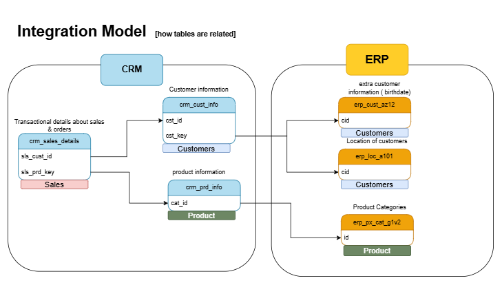
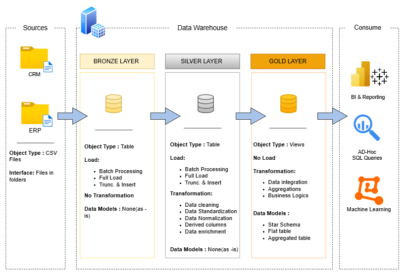
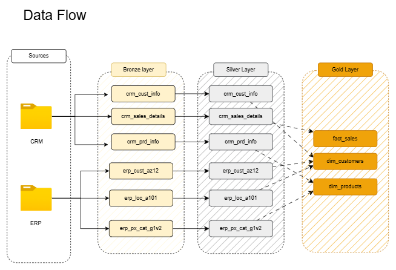
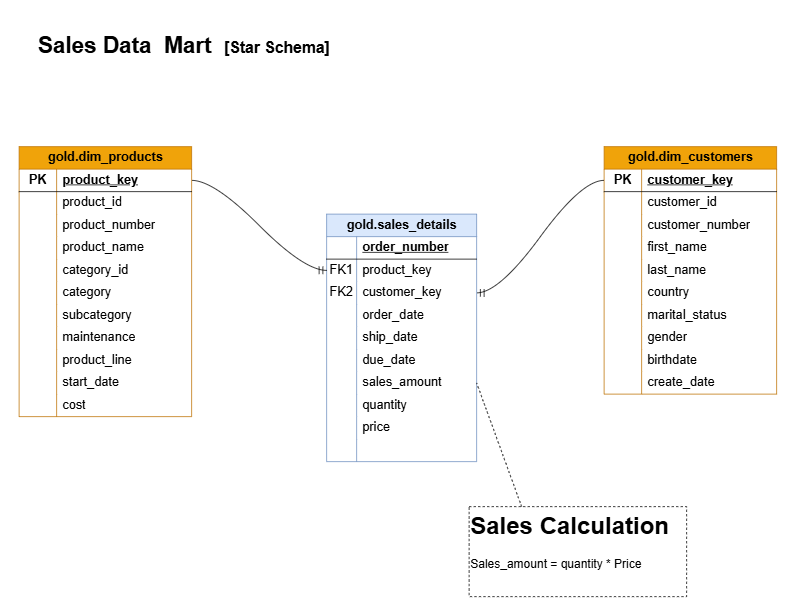

# 📘 SQL Data Warehouse Project

This project demonstrates the design and implementation of a modern data warehouse using SQL Server.  
It includes building ETL pipelines, cleaning raw data, designing data models, and creating analytical queries for business insights.

The goal of this project is to showcase practical skills in data engineering, data modeling, and SQL analytics using a real-world style workflow.

---

## 🚀 Project Overview

In this project, I built a complete data warehouse pipeline from raw CSV files to business-ready analytical tables.

The project simulates integrating data from multiple source systems (CRM and ERP) into a centralized data warehouse using Medallion Architecture.

The project includes:

- Loading raw data from multiple source systems
- Cleaning and transforming data
- Designing a layered data warehouse
- Creating fact and dimension tables
- Writing analytical SQL queries
- Generating insights from the data

This project follows industry-style data warehouse architecture.

---

## 📂 Data Sources

The data warehouse integrates data from two simulated source systems.

### CRM Source
Contains customer, product, and sales transaction data.

Tables:
- crm_cust_info
- crm_prd_info
- crm_sales_details

### ERP Source
Contains additional customer and product information.

Tables:
- erp_cust_az12
- erp_loc_a101
- erp_px_cat_g1v2

All source data is stored as CSV files and loaded into the bronze layer before transformation.



---

## 🏗️ Data Architecture



This project uses the Medallion Architecture with three layers.

### Bronze Layer
- Stores raw data from source systems
- Data loaded from CSV files into SQL Server
- No transformations applied

### Silver Layer
- Data cleaning and standardization
- Data normalization and enrichment
- Derived columns and validation
- Prepared for modeling

### Gold Layer
- Business-ready tables
- Star schema design
- Optimized for analytics and reporting



---

## 🏗️ Data Model



The gold layer follows a dimensional model with fact and dimension tables designed for analytical queries and reporting.

---

## 🛠️ Technologies Used

- SQL Server
- T-SQL
- Data Warehousing
- ETL Pipelines
- Data Modeling
- Git & GitHub
- Draw.io

---

## 📊 Skills Demonstrated

- Data Warehousing
- ETL Development
- Data Cleaning & Transformation
- Star Schema Modeling
- SQL Analytics
- Database Design
- Git Version Control

---

## 📦 Project Structure
```
sql-data-warehouse-project/
│
├── datasets/ # Raw data files (CRM & ERP)
├── docs/ # Diagrams and documentation
├── scripts/
│ ├── bronze/ # Raw layer load
│ ├── silver/ # Cleaned layer
│ └── gold/ # Analytical layer
│
├── tests/ # Data quality checks
├── README.md
```

---

## 🎯 Project Goals

- Build a modern data warehouse using SQL Server
- Practice ETL pipeline development
- Learn Medallion Architecture (Bronze / Silver / Gold)
- Improve data modeling skills
- Create a portfolio-ready data engineering project

---

## 📝 Notes

This project is for learning purposes and follows real-world data engineering practices.  
The goal is to simulate how data warehouses are built in industry environments.

---

## 👤 Author

Fiyinfoluwa Osifala

---

## 📜 License

This project is for educational use.

---

## 🙏 Acknowledgment

This project was inspired by a data engineering tutorial and was built as part of my learning process.  
All code, documentation, and structure in this repository were written by me for practice and portfolio purposes.
